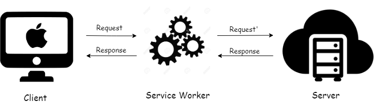

# Offline Content & Streaming Demo

## Introduction

This demonstration provides an example of using service workers to automatically cache website content (or any predefined set of assets) or selectively cache specific types of content (such as audio files) based on a certain message sent from the frontend in response to user action.

This is a significant step toward building a Progressive Web App.

## Progressive Web Apps

A progressive web app (PWA) is an app that's built using web platform technologies, but that provides a user experience like that of a platform-specific app.

PWAs have the benefits of websites, including:

- PWAs are developed using standard web platform technologies, so they can run on multiple operating systems and device classes from a single codebase.
- PWAs can be accessed directly from the web.

PWAs also have many of the benefits of platform-specific apps, including:

- PWAs can be installed on the device.
- PWAs can operate in the background and offline.

## What is a Service Worker?

In simple terms, it's a script that the browser runs in the background, completely independent of web pages or the DOM, and provides built-in features. It also helps cache assets and other files, ensuring that users can access content even when offline or on a slow network.

Some of these features include proxying network requests, push notifications, and background sync. Service workers ensure a rich offline experience for users.

You can think of a service worker as an intermediary between the client and server, every request made to the server passes through it. Essentially, it acts as a middleman. Since all requests go through the service worker, it can intercept them on the fly.

## How It All Fits Into the Picture

Service workers are fundamental to Progressive Web Apps (PWAs) because they enable many of the key features that make PWAs feel like native apps. Some of these features include offline functionality and caching, as well as improved performance.

## Final Words

Feel free to explore the repository and review the source code for the service workers and how everything fits into a typical React Webpack application.
